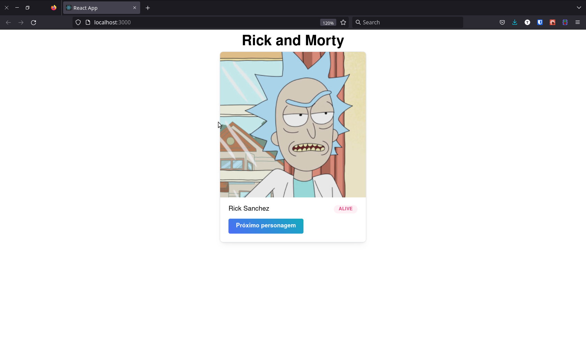
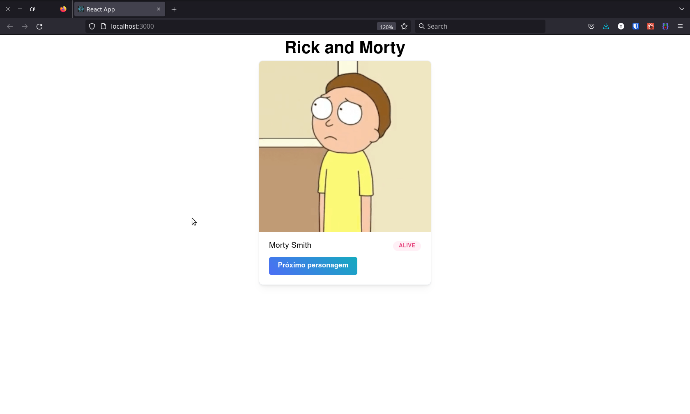

# Rick and Morty

Workshop de React na Universidade Católica do Tocantins, ministrado por mim, utilizando [API de Rick and Morty](https://rickandmortyapi.com/).

## Setup

Para clonar este repositório, basta clicar no botão verde desta página, copiar a URL e executar o comando `git clone` seguido da URL copiada.

Use o comando `npm install` para instalar as dependências e em seguida `npm start` para iniciar a aplicação.

## A aplicação

Consiste em uma simples página web para visualizar os personagem do desenho _Rick and Morty_, com seus respectivos metadados: nome e status.

Além da imagem do personagem há um botão para ir para o próximo personagem. Veja o que acontece ao clicar no botão:

## Implemenação

Este comportamento de mudança de estado foi implementado com os _Hooks_ do React: _UseEffect_ e _UseState_.

## Desafio

Ao final da aula, passei um desafio no [Kahoot](https://kahoot.it/) para o pessoal aprofundar o que foi abordado no workshop.
